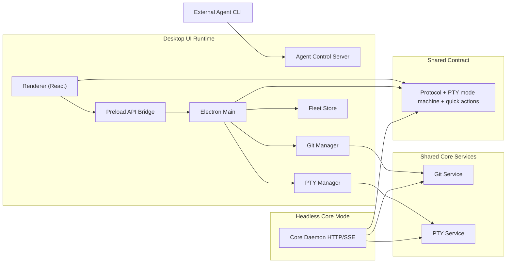

# Architecture Deep Dive

This document explains Forkline in depth: why it exists, how it is built, what it requires, and how the pieces behave together.

Scope note: this is based on the current repository implementation.

## 1. Project ideology

Forkline is designed around a few explicit ideas:

- **Local-first control plane**: all orchestration runs on your machine; no mandatory cloud service for control logic.
- **Agent-agnostic execution**: Forkline orchestrates CLI agents, it does not replace agent/model providers.
- **Worktree-native parallelism**: each task maps to isolated Git worktrees/branches to reduce cross-task interference.
- **Operator-in-the-loop safety**: approvals and blocked actions are visible and actionable in a single control surface.
- **Stateful operations**: terminal/session/task state is persisted enough to survive reloads and app restarts.
- **Security-by-default on localhost**: loopback-only APIs, token auth, origin rejection, and strict payload guards.

## 2. High-level architecture



## 3. Runtime modes

### GUI mode

- Entry: `electron/main.ts`
- View/state: `src/App.tsx`, `src/hooks/useOrchestrator.ts`
- Terminal rendering: `src/components/Terminal.tsx`
- IPC contract: `electron/preload.ts` + `src/global.d.ts`
- Control server: `electron/agentServer.ts`

### Core daemon mode

- Entry: `packages/core/bin/forkline-core.js`
- API server: `packages/core/src/daemon.js`
- Services: `packages/core/src/services/git-service.js`, `packages/core/src/services/pty-service.js`

## 4. Component responsibilities

### Renderer (React)

- project/task UX, spawn flows, progress overlays, approvals, collisions, timeline/diff views
- subscribes to PTY and agent events through typed preload APIs
- keeps UI non-blocking via async IPC and optimistic-but-safe state transitions

### Preload bridge

- exposes `window.electronAPI` and shields renderer from direct Node/Electron access
- maps invoke/send/on channels for Git, PTY, fleet, store/session, and approval actions

### Electron main

- registers IPC handlers
- lifecycle/orchestration wiring across git manager, pty manager, control server, persistence
- enforces browser window hardening (`contextIsolation`, `sandbox`, navigation constraints)

### PTY manager + PTY service

- session creation/attach/write/resize/restart/destroy
- mode detection and blocked-state signaling
- resource caps and env sanitization

### Git manager + Git service

- source validation, worktree create/list/remove/merge
- diff and modified-file inspection
- branch/worktree safety checks

### Agent control server

- accepts approved local actions from agent runtime
- validates loopback + token + allowlisted actions
- handles approval request lifecycle and response plumbing

### Fleet store

- persists project/task/event overview for cross-session visibility
- powers timeline and task summary UX

## 5. Key end-to-end flows

### Task creation and launch

1. Renderer validates repository path.
2. Worktree + branch are created.
3. Workspace artifacts are prepared (`.agent_cache` etc.).
4. PTY session is created and agent launch command is executed.
5. Output/mode/state streams drive UI status.

### Session restore after app restart

1. Runtime session snapshot is loaded.
2. Tabs/tasks are reconstructed.
3. PTY attach is attempted.
4. If PTY is missing, relaunch pipeline is executed.
5. Progress is shown until real output is available.

### Approval and blocked prompts

1. Agent emits action request via local control endpoint.
2. Request is validated and queued.
3. UI inbox surfaces action.
4. Operator approves/rejects/responds.
5. Decision returns to requester and is recorded as fleet event.

## 6. Security boundaries

Implemented controls include:

- loopback-only acceptance for local HTTP surfaces
- token auth for non-public endpoints
- cross-origin localhost request rejection
- rate limits and payload size limits
- SSE client caps and PTY session caps
- strict path/task validation
- timing-safe token comparison

Security-critical files:

- `packages/core/src/daemon.js`
- `packages/core/src/services/pty-service.js`
- `packages/core/src/services/git-service.js`
- `electron/agentServer.ts`

## 7. Data and persistence model

Persisted local state includes:

- `workspace.json` (workspace-level defaults/state)
- `runtime-session.json` (session recovery state)
- `fleet.sqlite` (task/event history)
- `~/.forkline/core.token` (core daemon auth token)

Environment variable behavior:

- UI-entered environment variables are used for runtime process environment injection.
- They are intentionally excluded from workspace store persistence path in code.

## 8. System requirements

### Required

- Node.js `>=20`
- npm `>=10`
- Git in `PATH`
- supported agent CLI command in `PATH` (for GUI agent launch)

### Recommended

- enough disk for multiple worktrees and optional local build artifacts
- terminal-compatible environment with PTY support
- macOS/Linux local shell tooling for best compatibility

## 9. Operational requirements

For reliable team usage:

- define merge/delete policy for task branches
- establish approval policy (manual vs auto for specific actions)
- keep branch/worktree naming conventions consistent
- run security/build checks before release pushes

Recommended routine checks:

```bash
npm run typecheck
npm run build
npm run security:smoke
npm run test:core
npm run test:pty-replay
```

## 10. Design tradeoffs

### Why this architecture works

- clear split between UI concerns and runtime services
- shared core services used by both GUI and headless modes
- protocol package avoids contract drift across runtimes
- local-first model reduces external control-plane dependencies

### Accepted tradeoffs

- Electron + PTY introduces platform-specific edge cases
- session restore requires careful state coordination across IPC and process boundaries
- high-volume parallel tasks can stress local machine resources

## 11. Known limitations and future opportunities

Known limits:

- E2E smoke stability can vary by host/CI environment
- provider-specific resume/session semantics are heterogeneous
- large concurrent fleets depend on host CPU/memory/IO capacity

High-value future work:

- stronger PTY startup telemetry and diagnostic UX
- deeper contract tests for preload/runtime parity
- richer collision resolution workflows per project
- deterministic multi-platform smoke harness for Electron startup

## 12. How to reason about the project quickly

If you are new and want to understand behavior fast, inspect in this order:

1. `src/hooks/useOrchestrator.ts` (state machine + user-level flows)
2. `electron/preload.ts` and `src/global.d.ts` (UI contract)
3. `electron/main.ts` (orchestration wiring and persistence)
4. `electron/ptyManager.ts` and `packages/core/src/services/pty-service.js` (terminal behavior)
5. `packages/core/src/daemon.js` (security and API behavior)

## 13. Related docs

- [Architecture Overview](/architecture/overview)
- [Project Dossier](/guide/project-dossier)
- [New System Setup](/guide/new-system-setup)
- [Core API](/reference/core-api)
