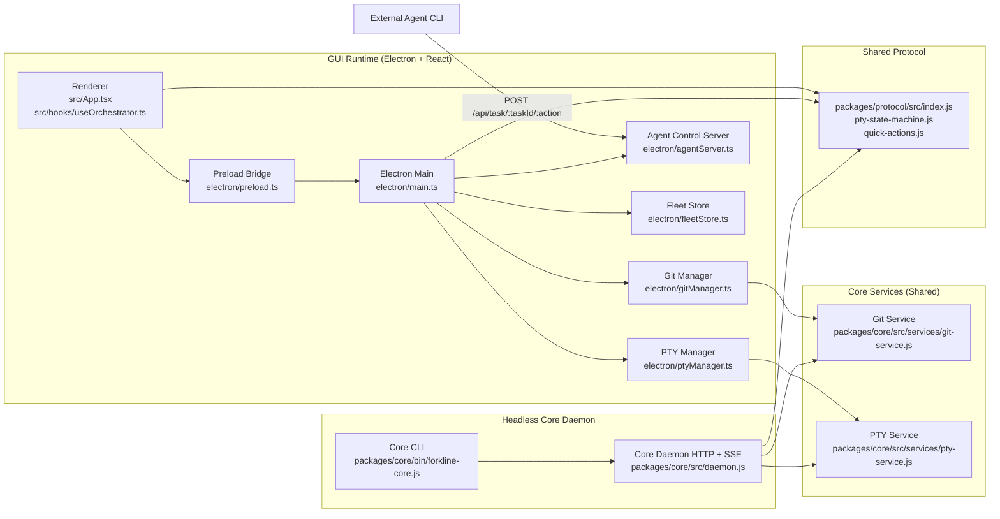

# Architecture

This page describes the architecture that is currently implemented in code.

## Diagram

## Runtime modes

### GUI mode (Electron + React)

- Entry: `electron/main.ts`
- Renderer: `src/App.tsx` + `src/hooks/useOrchestrator.ts`
- Preload bridge: `electron/preload.ts` and `src/global.d.ts`
- Git orchestration: `electron/gitManager.ts` -> `packages/core/src/services/git-service.js`
- PTY orchestration: `electron/ptyManager.ts` -> `packages/core/src/services/pty-service.js`
- Agent control HTTP server: `electron/agentServer.ts`
- Fleet persistence: `electron/fleetStore.ts`

### Core daemon mode (headless)

- CLI entry: `packages/core/bin/forkline-core.js`
- HTTP + SSE server: `packages/core/src/daemon.js`
- Services:
  - `packages/core/src/services/git-service.js`
  - `packages/core/src/services/pty-service.js`

## Shared contract

- `packages/protocol/src/index.js`
- `packages/protocol/src/pty-state-machine.js`
- `packages/protocol/src/quick-actions.js`

## Implemented request paths

### Worktree path (GUI)

1. Renderer calls `window.electronAPI.createWorktree(...)`.
2. Preload sends `git:createWorktree`.
3. `electron/gitManager.ts` calls `GitService.createWorktree(...)`.
4. `GitService` performs git worktree/branch operations.

### PTY path (GUI)

1. Renderer sends `pty:create`, `pty:write`, `pty:resize`, etc.
2. `electron/ptyManager.ts` calls `PtyService`.
3. PTY output/state events are pushed back over IPC channels (`pty:data:<taskId>`, `pty:mode:<taskId>`, `pty:exit:<taskId>`).

### Agent approval path (GUI)

1. Agent sends HTTP to `AgentControlServer` (`/api/task/:taskId/:action`).
2. `electron/agentServer.ts` validates loopback + token + action.
3. For approval-required actions, renderer receives `agent:request`.
4. Renderer responds with `agent:respond` and decision is returned/persisted.

### Core API path

1. Core daemon serves `/v1/*` routes from `daemon.js`.
2. Any local client can call core HTTP routes and subscribe to `/v1/events`.

## Security boundaries in code

- Loopback-only request acceptance in `packages/core/src/daemon.js` and `electron/agentServer.ts`.
- Token auth checks in both servers.
- Browser-origin request rejection in both servers.
- Request and PTY payload limits enforced in server/service layers.
