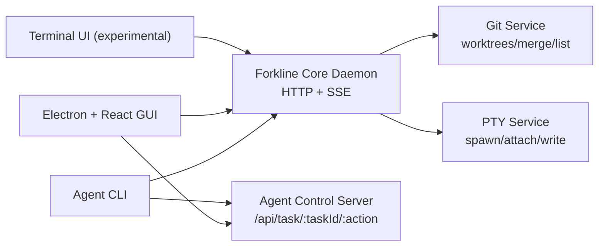

# Architecture Overview

Forkline is a local-first orchestration layer for coding agent CLIs.

## Runtime layers

1. Agent process layer (`claude`, `aider`, `codex`, etc.)
2. Forkline orchestration layer (`core`, `electron`, `tui`)
3. Operator interface layer (`gui` or `tui`)

## System diagram

## Stability tiers

- `core`: stable
- `gui`: stable
- `tui`: experimental

## Design goals

- Deterministic local orchestration and session lifecycle
- Worktree isolation as a default safety primitive
- Human approval checkpoints for sensitive actions
- Strong local API hardening and secret hygiene

## Non-goals

- Replacing model CLIs
- Cloud-hosted orchestration dependency for baseline use
- Multi-tenant remote control plane guarantees
