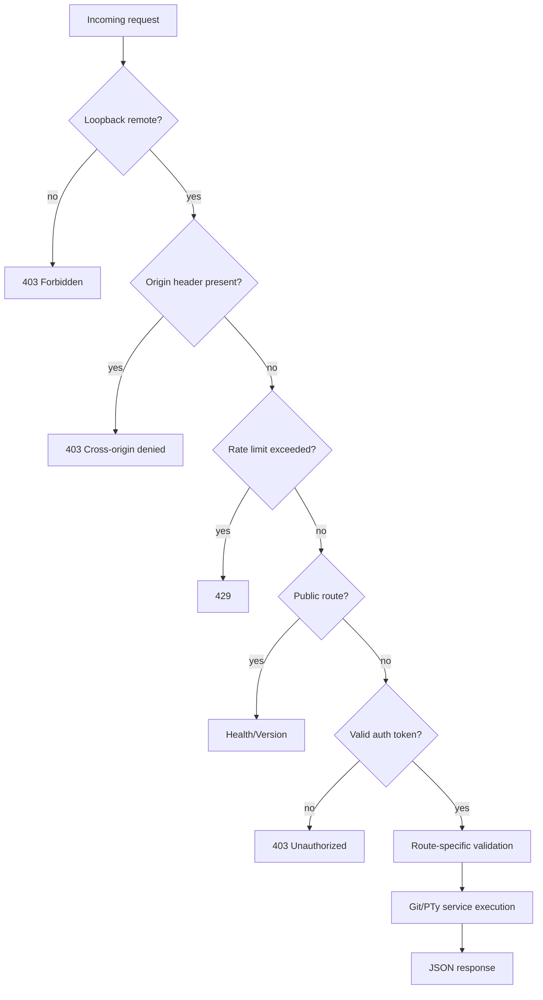
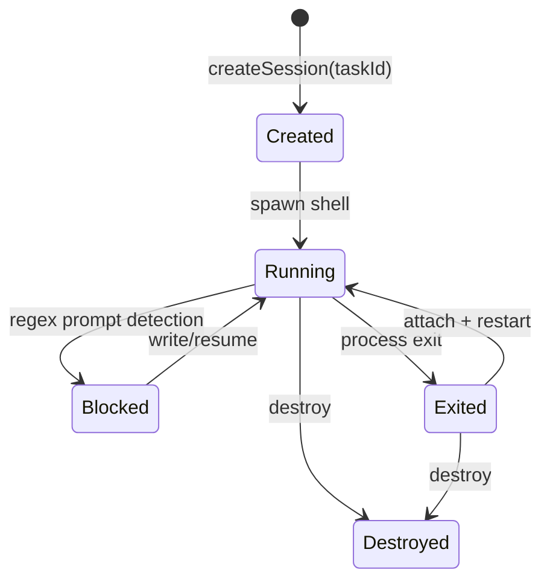

# Runtime Flows

## Core daemon request handling



## PTY lifecycle



## Worktree lifecycle

1. Validate source path and Git state.
2. Ensure initial commit exists.
3. Compute safe task branch and target worktree path.
4. Reuse existing worktree if already present.
5. Create branch/worktree from requested base branch when available.
6. Merge/remove workflow cleans worktree and branch.

## Event stream model

Core emits SSE envelopes:

```json
{
  "id": "1700000000000-ab12cd",
  "ts": 1700000000000,
  "type": "pty.data",
  "payload": {
    "taskId": "task-1",
    "data": "..."
  }
}
```
