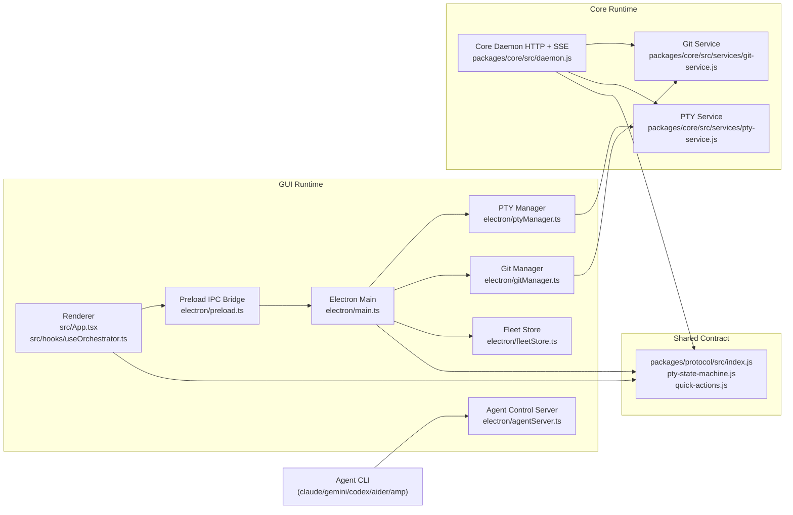

# Forkline Project Dossier

This page is the complete technical reference for the current Forkline codebase.

Last verified against repository state on **February 26, 2026**.

## 1. What Forkline Is

Forkline is a local-first orchestration platform for running multiple coding agent CLIs in parallel across isolated Git worktrees.

Forkline is not a model or agent replacement. It is an operator layer that adds:
- task/worktree lifecycle management
- PTY session orchestration and restore
- approval and blocked-prompt control
- cross-task observability and fleet history

## 2. Repository Map

| Path | Purpose |
|---|---|
| `src/` | Renderer UI (React) and client-side orchestration state |
| `electron/` | Electron main process, preload bridge, PTY/Git integration, agent control server |
| `packages/core/` | Headless core daemon and security-sensitive services |
| `packages/protocol/` | Shared contracts (protocol constants, PTY state machine, quick actions) |
| `docs/` | Public documentation (VitePress, GitHub Pages source) |
| `documents/` | Internal operational documents (threat model, release playbook, fixtures) |
| `scripts/` | Build/dev/security/release support scripts |

## 3. Runtime Architecture



## 4. Runtime Modes

### GUI mode (desktop app)
- Launch: `forkline` or `npm run dev`
- Entry point: `electron/main.ts`
- UI state + interactions: `src/App.tsx`, `src/hooks/useOrchestrator.ts`
- Terminal rendering: `src/components/Terminal.tsx`

### Core mode (headless daemon)
- Launch: `forkline-core` or `npm run core:start`
- Entry point: `packages/core/bin/forkline-core.js`
- API server: `packages/core/src/daemon.js`

## 5. Main Workflows

### Task lifecycle
1. Validate source repo.
2. Create worktree + branch for task.
3. Prepare workspace artifacts and agent launch command.
4. Start/attach PTY.
5. Stream output and mode/blocked state.
6. Review diffs and modified files.
7. Merge or remove worktree.

### PTY restore lifecycle
1. Reopen app and restore runtime session state.
2. Attempt PTY attach for each visible task.
3. If PTY missing, run relaunch pipeline.
4. Show startup progress UI until real terminal output arrives.
5. Transition to live terminal.

### Approval lifecycle
1. Agent sends approval-required action to local control server.
2. Request is queued and surfaced in UI inbox.
3. Operator approves/rejects/responds.
4. Response is returned to requester and recorded in fleet events.

## 6. API and Contract Surfaces

### 6.1 Core daemon API (`http://127.0.0.1:34600`)

Public routes:
- `GET /v1/health`
- `GET /v1/version`

Authenticated routes include:
- `GET /v1/events`
- `GET /v1/pty/sessions`
- `POST /v1/git/validate`
- `POST /v1/git/worktree/create`
- `POST /v1/git/worktree/list`
- `POST /v1/git/branches/list`
- `POST /v1/git/worktree/remove`
- `POST /v1/git/worktree/merge`
- `POST /v1/git/diff`
- `POST /v1/git/modified-files`
- `POST /v1/pty/create`
- `POST /v1/pty/attach`
- `POST /v1/pty/detach`
- `POST /v1/pty/write`
- `POST /v1/pty/resize`
- `POST /v1/pty/destroy`

Auth headers:
- `Authorization: Bearer <token>`
- `x-forkline-token: <token>`

See full payload examples in [/reference/core-api](/reference/core-api).

### 6.2 Electron preload bridge (`window.electronAPI`)

Main groups:
- app/system: dialogs, clipboard, external URLs, agent discovery, session listing
- git/worktree: validate/create/list/diff/modified/merge/remove
- PTY: create/write/launch/resize/restart/detach/destroy/list + stream listeners
- fleet/store/session: persist and query project/task runtime data
- agent callbacks: approval requests, todos, messages, usage, blocked status

Type contract source:
- `electron/preload.ts`
- `src/global.d.ts`

### 6.3 Agent control server

Local HTTP actions are received through `electron/agentServer.ts` for approved action set (`merge`, `todos`, `message`, `usage`/`metrics`) with token + loopback protections.

## 7. Security Model (Implemented)

Core protections currently enforced:
- loopback-only for local HTTP control surfaces
- token auth on non-public routes
- browser-origin rejection for localhost APIs
- payload/request size limits
- request rate limits
- SSE client caps
- PTY session caps and write-size limits
- strict task-id/path validation
- timing-safe token comparison

Security-sensitive files:
- `packages/core/src/daemon.js`
- `packages/core/src/services/pty-service.js`
- `packages/core/src/services/git-service.js`
- `electron/agentServer.ts`

## 8. UI, Interaction, and Feedback Model

Implemented interaction classes:
- project/task side rail and active tab model
- spawn agent modal and session-picker flow
- approval inbox (pending approvals + blocked prompts)
- startup/relaunch progress overlays for terminal bring-up
- status badges (dirty/blocked/collision/clean)
- diff, timeline, worktree, and quick-action panels

Responsiveness and safety behavior:
- long operations use asynchronous IPC and non-blocking UI state updates
- PTY output streams incrementally
- restored/relaunching sessions use explicit progress state before live output
- sandbox/network guardrail signals are exposed in PTY state and UI bannering

## 9. Data and Persistence

Persistent local state includes:
- fleet projects/tasks/events/session metadata (`electron/fleetStore.ts`)
- renderer store/runtime session snapshots (`store:*`, `session:*` IPC handlers)
- PTY runtime session registry and per-task state (managed by PTY service/manager)

Representative UI task model types are defined in `src/models/orchestrator.ts`.

## 10. Build, Test, and Release

## Build commands

```bash
npm ci
npm run typecheck
npm run build
```

### Validation commands

```bash
npm run security:smoke
npm run test:core
npm run test:pty-replay
npx playwright test e2e/electron.smoke.spec.js
npm run preflight:release
```

### Packaging commands

```bash
npm run dist:local
npm run release
```

Release preflight checks (`scripts/release-preflight.js`) verify:
- required runtime files exist
- package `files`/`bin` entries are correct
- npm tarball contains required runtime modules

## 11. Deployment and Docs

### Documentation
- local docs dev server: `npm run docs:dev`
- production docs build: `npm run docs:build`
- docs are sourced from `docs/` (VitePress)

### GitHub Pages
- docs publish should run from `main` branch workflow
- site base path is derived in `docs/.vitepress/config.mts`

## 12. Config and Environment

Common runtime inputs:
- Node.js >= 20
- Git executable in `PATH`
- supported agent CLIs in `PATH`

Core daemon env knobs include:
- `FORKLINE_CORE_TOKEN`
- `FORKLINE_CORE_MAX_BODY_BYTES`
- `FORKLINE_CORE_MAX_PTY_WRITE_BYTES`
- `FORKLINE_CORE_MAX_SSE_CLIENTS`
- `FORKLINE_CORE_RATE_LIMIT_PER_MINUTE`
- `FORKLINE_CORE_MAX_PTY_SESSIONS`

Branding and app identity:
- package metadata + builder settings in `package.json`
- static logo assets in `public/` and `docs/public/`
- app branding config in `config/app-branding.json`

## 13. Known Gaps and Next Improvements

High-impact improvements to prioritize:
- stabilize Electron Playwright smoke in CI for deterministic first-window readiness
- add deeper integration tests for full restore/relaunch and approval edge cases
- expand contract tests to enforce preload/runtime parity automatically
- add explicit retry/timeout telemetry for PTY spawn failures per platform
- add richer project-scoped collision resolution workflows in UI

## 14. Contributor Git Workflow (Commit + Push)

Standard flow for any change:

```bash
git checkout -b spasnoor/<topic>
# edit files
npm run typecheck
npm run build
git add -A
git commit -m "docs: add comprehensive project dossier"
git push -u origin spasnoor/<topic>
```

Direct update flow for current branch:

```bash
git add -A
git commit -m "<message>"
git push
```

If `main` is protected, use PR merge rules instead of force push.
